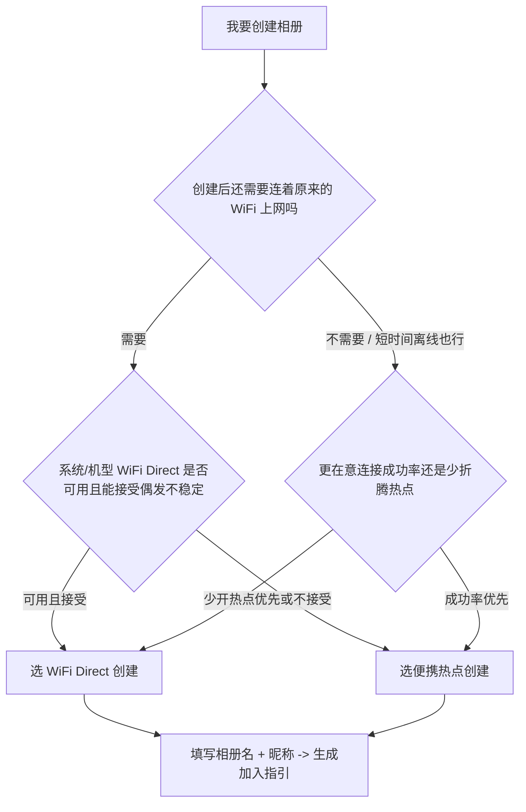

# 共享相册：MVP 界定、阶段暂缓、双模式决策树与技术风险（gstack / office-hours 整理稿）

**需求唯一来源**：`docs_共享相册App需求文档.md`  
**生成说明**：由对话中按 gstack office-hours 思路整理；文中 **7.1 / 7.2** 等均指该需求文档章节。

---

## 术语：MVP 是什么

**MVP** 是 **Minimum Viable Product** 的缩写，中文常译为 **最小可行产品**（或最小可用版本）。

含义是：用 **尽量少的功能**，做出一个 **能真实用起来、能验证核心价值** 的版本，而不是一上来就做全功能。

在本需求文档中，**§7.1 第一阶段**描述的就是 MVP：**能建相册、在 WiFi Direct 模式下传图与浏览**等，先跑通主流程；更复杂的协作、标记、评论等放在后续阶段。

---

## 文档口径说明（7.1 与 2.1.1 的差异）

- **§7.1** 写明 MVP 交付为 **WiFi Direct 模式**下的上传与浏览。
- **§2.1.1** 又要求 **WiFi Direct + 便携热点** 两种创建模式。

下文 **MVP 严格对照 §7.1**；**热点模式**在全文功能描述中存在，与里程碑表述不一致，建议在 MVP 验收后安排 **1 天 spike** 决定是否并入「MVP+」并回写里程碑。

---

## 1. 最小可行 MVP（对照 §7.1）

### 目标（引用 §7.1）

实现基本的相册创建和照片共享。

### 交付形态（引用 §7.1）

可运行的应用原型；**WiFi Direct 模式下**支持照片上传与浏览。

### MVP 功能边界（将 §7.1「功能范围」落成可验收条目）

| 能力 | MVP 要求（对齐文档意图） |
|------|---------------------------|
| 相册创建（群主） | 设置相册名 + 自己昵称；完成 P2P 群组创建；提供加入指引（地址/端口/步骤，§2.1.1） |
| 加入相册（成员） | 主动发现/扫描并连接（§2.1.2；被动等待可弱化，非 §7.1 必列项） |
| HTTP 服务（群主） | 支撑列表、上传、下载原图/缩略图（§3.2.2 端点意图；可先不实现全套 API 面） |
| 照片上传 | 多选、上传、进度（§2.1.4）；**分片断点续传**属增强项，MVP 可用失败重试/重新选择替代 |
| 照片浏览 | 网格缩略图 + 详情查看（§2.1.3；筛选排序可砍） |
| 照片下载 | 单张下载到本地（§2.1.5；批量与目录策略可砍） |
| 基础 UI | Jetpack Compose 主流程（§3.2.6 / §4.2 主干页面） |
| 本地数据 | Room 元数据最小闭环（§3.2.4；markers/users 复杂结构可后移） |

### 刻意不包含在 MVP 中（相对全文，但符合 §7.1）

- **便携热点创建模式**（与 §7.1「仅 WiFi Direct」表述冲突，见上文口径说明）。
- **WebSocket 实时协作全家桶**（§3.2.3；§7.2 阶段目标）。
- **标记 / 评论 / 社交元数据**（§2.1.7；§7.2）。
- **回收站误删恢复**（§2.1.6）及删除同步的完整产品级策略。
- **设置中心大套餐**（§2.2.3）与 **§5.1 性能指标全盘达标**：MVP 以「关键路径可用」为主。

---

## 2. 若只做 MVP：需从第二阶段（§7.2）暂缓的功能

按 **§7.2 第二阶段：协作功能** 原文，**整体暂缓**（MVP 不交付）：

1. **实时同步**（对应 WebSocket 推送、在线一致体验，§3.2.3）。
2. **照片标记**（收藏/评分/标签等，§2.1.7）。
3. **评论功能**（含 @、通知等，§2.1.7）。
4. **设备管理**（§7.2；对应连接管理/列表/断开等的产品化版本，§2.2.2）。

**补充**：文档其他章节中偏「第二、三阶段才合理」的能力，会随 §7.2 起跳自然延后，例如：信号强度分级、手动重连产品化、批量下载管理、下载目录策略、通知细分、存储自动清理规则等（§2.1.5、§2.2.2、§2.2.3、§7.3）。

---

## 3. WiFi Direct / 便携热点双模式：用户决策树

依据 **§2.1.1**（两种模式的利弊与选择权）。

### 决策规则（文档语义的用户向表述）

- **偏 WiFi Direct**：希望尽量 **不依赖热点**，在 **支持的机型** 上使用直连（无需中间基础设施；部分场景仍可保留原 WiFi，§2.1.1）。
- **偏热点**：**兼容/连接困难**时，或接受 **「开热点换稳定」**（兼容性更好；创建者 **通常无法同时连其他 WiFi**，§2.1.1）。

---

## 4. 三条最大技术风险与「1 天内可完成」的验证实验

### 风险 1：WiFi Direct 在主流 ROM 上「能发现但连不上 / 频繁掉线」

- **为何关键**：§7.1 MVP 押注 WiFi Direct；§3.2.1 已写明 OEM 差异。
- **1 天实验**：准备 **3～4 台真机**（至少 2 个不同厂商 + 不同 Android 大版本），固定距离（室内 5 m / 10 m 各一轮），重复同一流程：**建组 → 扫描 → 连接 → 连续 ping 或小文件拉取 10 分钟**。输出表：**成功率、平均建连时延、掉线次数、是否依赖重试**。

### 风险 2：群主嵌入式 HTTP（NanoHTTPD）在多客户端并发上传/下载下阻塞、错误率上升或文件损坏

- **为何关键**：MVP 价值在传照片；§3.2.2 涉及并发与大文件/Range 诉求。
- **1 天实验**：**2～3 个客户端** 对群主同时：**2 路并行 multipart 上传（接近单张上限）+ 1 路列表缩略图压力**，持续 30～60 分钟；记录 **5xx/断连率、上传结果 hash 抽样**、群主 CPU/内存峰值。结论给出 **可靠并发上限**（例如同时几路上传）。

### 风险 3：定位 / 附近设备权限导致「用户拒绝后发现功能长期不可用」

- **为何关键**：§5.4 列出 WiFi 发现相关权限；Android 12/13+ 的 **NEARBY_WIFI_DEVICES** 与历史定位权限纠缠，易卡死在第一步。
- **1 天实验**：**Android 12、13、14 各一台**（或模拟器补齐），走：**首次扫描 → 拒绝 → 再次进入 → 系统设置补救**，记录 **能否恢复扫描**、跳转次数、厂商额外开关。产出 **权限说明文案 + 最短恢复路径**（可直接进产品）。

---

## 修订记录

| 版本 | 日期 | 说明 |
|------|------|------|
| 1.0 | 2026-04-13 | 合并对话中 gstack/office-hours 风格输出为单文档 |

---

*本文档不替代 `docs_共享相册App需求文档.md`；冲突处以需求文档为准，并建议回写里程碑与 §7.1 表述以消除歧义。*
