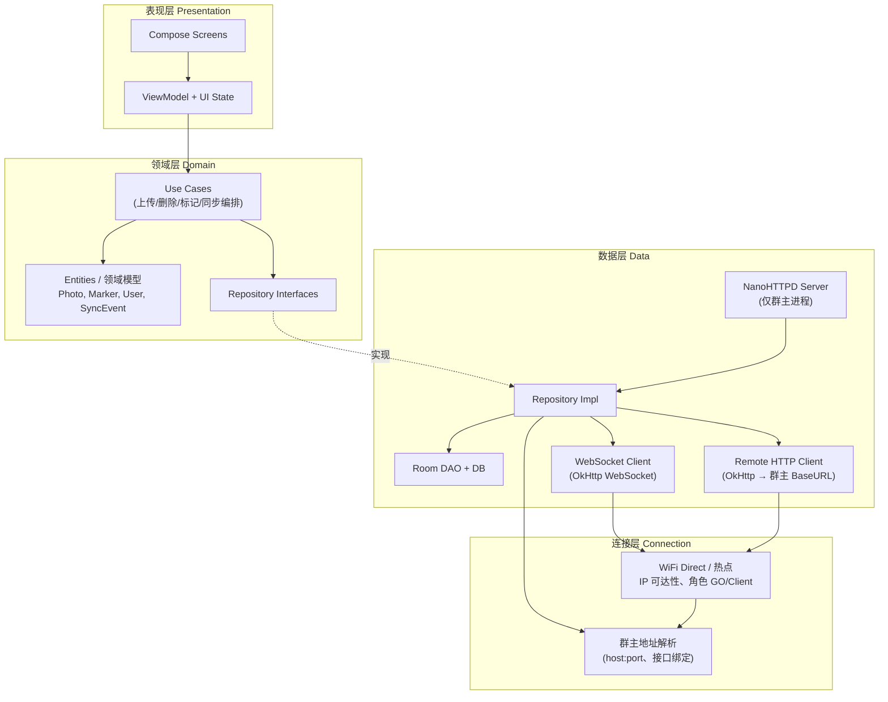
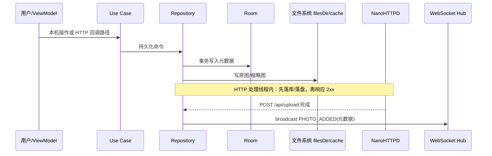
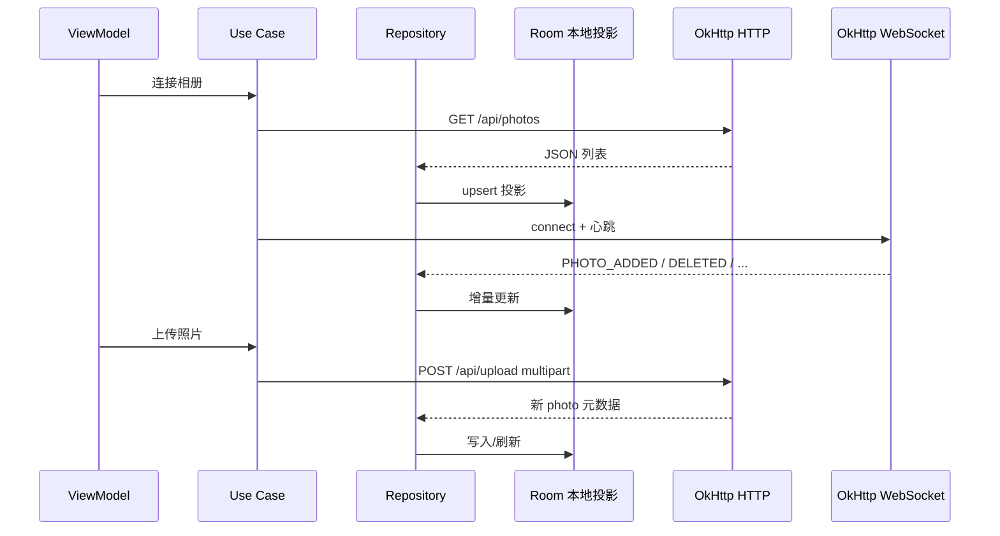

# 共享相册：工程评审（Plan Eng Review）

**需求来源**：`docs_共享相册App需求文档.md`（第 3 章为主，并引用 §5.2 分片/断点、§5.3 存储、第 6 章测试）  
**评审类型**：plan-eng-review（架构边界、数据流、协议一致性、并发与存储、测试矩阵）  
**文档状态**：草案  
**日期**：2026-04-13

---

## 1. 模块边界图（Clean + MVVM + Connection / Data 分家）

文档 **§3.1** 定义四层：**Presentation / Domain / Data / Connection**。依赖规则：**外层 → 内层**，Domain 不依赖 Android 框架与具体网络栈。

### 边界裁决（避免后期耦合）

- **NanoHTTPD**：只属于群主侧 **Data** 的 `AlbumServer` 实现细节；**Domain** 只认识「相册会话已建立、可上传/拉列表」等端口，不直接依赖 `NanoHTTPD` API。
- **WebSocket**：群主维护客户端套接字集合；**广播**应在 **HTTP 已成功提交事实**（或 DB 已提交事务）之后触发，见第 3 节。
- **Room**：群主为 **权威元数据 + 本地文件路径**；客户端为 **缓存/投影**（与 §3.3、§5.3「离开群组清除元数据」一致）。
- **Connection**：只负责「如何拿到群主 IP、如何保持链路」；**不**承载业务 JSON 解析与相册 CRUD。

---

## 2. 群主 / 客户端数据流（HTTP 事实 + WS 通知 + Room 投影）

### 2.1 群主（Group Owner）

**要点**（§3.2.2、§3.2.3、§3.2.4）：HTTP 用于「提交事实」；WebSocket 用于「增量通知」；断线客户端靠 `GET /api/photos`、`POST /api/sync` 或全量类消息补账。

### 2.2 客户端（Member）

### 2.3 分片上传与断线重连在架构中的位置

- **分片/断点**（§2.1.4、§5.2）：属于 **HTTP 上传协议**细节（`Range`、自定义 `Upload-Id`、分块 `PATCH` 或多段 `POST` 等须在接口层**一次定稿**）。**Room 仅在整文件校验完成后**写入最终 `Photo` 行，避免「列表可见但文件不可用」的半成品状态。
- **WebSocket 断线重连**（§3.2.3）：30s 心跳，连续失败 → 判定断开 → **指数退避重连**；重连后须 **HTTP 补同步**（例如 `GET /api/photos`；若需增量，工程上应增加 `version` / `If-Modified-Since` 等约定，需求文档未写则须在实现规范中补全）。
- **HTTP 与 WS 解耦**：WS 不可用不应阻塞上传/下载任务完成。

---

## 3. WebSocket 消息与 HTTP API 的一致性

### 3.1 文档内命名需先对齐

| 概念 | §3.2.3 WebSocket 文案 | §3.3.1 `EventType` | 建议 |
|------|------------------------|---------------------|------|
| 标记变更 | `MARKER_UPDATED` | `MARKER_ADDED` / `MARKER_REMOVED` | 统一为一种对外事件（含 `op`）或拆两条并与 WS 命名一致 |
| 全量同步 | `PHOTO_LIST_SYNC` | `FULL_SYNC` | 统一枚举名与 JSON `type` 字符串 |

**结论**：在实现前固定 **JSON `type` 字符串表**，Room / `SyncEvent` / `EventType` **共用同一套**。

### 3.2 事件 ↔ HTTP 映射（权威来源 = 群主 DB + 文件）

| WebSocket 类型（§3.2.3） | 触发的 HTTP 事实（须先成功） | 客户端无 WS 时的兜底 |
|--------------------------|------------------------------|----------------------|
| `PHOTO_ADDED` | `POST /api/upload` 2xx，且群主 DB 有 `Photo` | `GET /api/photos` |
| `PHOTO_DELETED` | `DELETE /api/photos/{id}` 2xx | `GET /api/photos` 或 `POST /api/sync` |
| `MARKER_*` / `MARKER_UPDATED` | 需为 marker 提供 HTTP 资源（§3.2.2 未列）或并入 `POST /api/sync` | `GET /api/photos/{id}` 或 sync |
| `COMMENT_ADDED` | 需评论相关 HTTP API（§3.2.2 未列） | 同步端点 |
| `USER_JOINED` / `USER_LEFT` | WS 连接生命周期 + 服务端登记 | 成员列表资源（若产品需要则补） |
| `PHOTO_LIST_SYNC` / `FULL_SYNC` | 新成员入群后 HTTP 拉全量 | `GET /api/photos` |

### 3.3 一致性规则（建议写入实现规范）

1. **先写库，再发 WS**：同一 `photoId` 的 `PHOTO_ADDED` 不得在 HTTP 未确认前发出。
2. **消息幂等**：携带 `eventId` 或 `(type, photoId, lastModified)` 去重；客户端 Room 使用 `INSERT OR REPLACE` 等策略。
3. **顺序**：不保证全局全序时，以 **`lastModified` 或单调 `version`** 裁决冲突；UI 以 DB Flow 为准。
4. **`POST /api/sync`（§3.2.2）**：定义为批量 `SyncEvent` 或快照补丁之一，与 WS JSON **共用 DTO**，避免两套协议。

---

## 4. 八台设备并发与群主存储瓶颈

文档依据：**最多 8 台**（§1.2、§3.2.1）；**单张 ≤50MB**（§5.2）；**空间不足 5GB 提示、近满禁止上传**（§5.3）；文件 **filesDir**、缩略图 **cache**（§5.3）；NanoHTTPD **每请求一线程**（§3.2.2）。

### 4.1 并发瓶颈（群主侧）

| 维度 | 风险 | 说明 |
|------|------|------|
| CPU | 多路 multipart 解析、缩略图生成（§3.2.5） | 8 客户端同时 POST |
| 磁盘 I/O | 多路大文件同时写入 | 50MB × 并行上传路数 |
| SQLite | 写事务串行；Flow 刷新频繁 | 每张照片至少一次写 |
| 内存 | 缓冲与图片解码 | 与 §5.1 内存目标存在张力 |
| 链路带宽 | §3.2.1 实际 50–100Mbps 量级 | 8 路并发易相互挤占 |

**工程建议**（与 §5.2 带宽自适应方向一致）：限制全局并发上传路数（例如 2～3），其余排队；缩略图生成与接收 **队列化**；`GET /api/photos` 增加 `etag`/`version` 减少全员全量拉取。

### 4.2 存储瓶颈（群主侧）

粗略量级：1000 张 × 5MB 原图已接近 §5.3「5GB 提示」线；另加缩略图与数据库。**评审意见**：「5GB 提示」不等于容量规划式阈值；应定义 **动态下限**（例如与「待上传队列 × 50MB + 缩略图预留」相关），避免高并发下半文件写入。

---

## 5. 测试矩阵（对齐第 6 章）

| 编号 | 章节 | 测试类型 | 被测模块/技术 | 关键场景 | 通过准则 |
|------|------|----------|----------------|----------|----------|
| T-U1 | §6.1 | 单元 | Domain UseCase | 上传/删除/标记增删 | Mock 依赖，确定性断言 |
| T-U2 | §6.1 | 单元 | Room DAO + Repository | 空库、级联删 markers | 内存 DB，CRUD + 迁移 |
| T-U3 | §6.1 | 单元 | ViewModel | 连接态、错误态、列表刷新 | Fake Repository |
| T-I1 | §6.2 | 集成 | WiFi Direct | 发现 → 连接 → 断开 | 双真机；或 Robolectric 模拟 P2P |
| T-I2 | §6.2 | 集成 | NanoHTTPD | `GET /api/photos`、`POST /api/upload`、DELETE 等 | MockWebServer 或进程内服务 |
| T-I3 | §6.2 | 集成 | WebSocket + HTTP | 上传后 WS 广播；断线重连后一致 | 断 WS 后以 HTTP 校验 |
| T-I4 | §6.2 | 集成 | 分片/断点（§5.2） | 中途断网、Range 续传 | 文件 hash 一致 |
| C1 | §6.3 | 兼容 | WiFi Direct | 华为/小米/OPPO/vivo/三星 × 版本 | 记录 workaround |
| C2 | §6.3 | 兼容 | 网络环境 | 多群组、干扰 | 连接成功率阈值 |
| S1 | §6.3 | 压力 | 全栈 | **8 设备同时连接 + 同时上传** | 无崩溃、无 DB 损坏 |
| P1 | §6.4 | 性能 | 启动 | 冷启动 ≤2s、热启动 ≤0.5s（§5.1） | Profiler / systrace |
| P2 | §6.4 | 性能 | 列表 | 1000 张缩略图、内存（§5.1） | LeakCanary + Profiler |
| P3 | §6.4 | 性能 | 群主 | 高负载电量（§5.1） | Battery Historian |

**说明**：§6.2 中 MockWebServer 与 **真实 NanoHTTPD + OkHttp** 各有价值；至少保留一条后者集成用例，以覆盖线程模型与大文件路径。

---

## 6. 执行前须拍板的事项（锁定建议）

1. **WebSocket 与 `EventType` 命名统一**，并增加 **幂等键 / 版本号** 字段。  
2. **Marker / Comment 的 HTTP 资源**与 §3.2.2 对齐，否则 WS 事件缺少可复查的真理来源。  
3. **分片上传的 HTTP 形态**（单端点多段 vs 多请求）写死，再确定 Room 写入时机与 T-I4 验收步骤。

---

## 修订记录

| 版本 | 日期 | 说明 |
|------|------|------|
| 1.0 | 2026-04-13 | 初稿：与对话中 plan-eng-review 输出同结构落盘 |

---

*本文档不替代 `docs_共享相册App需求文档.md`；与需求冲突时以需求文档为准，并在本文档「锁定建议」中推动需求或接口补全。*
