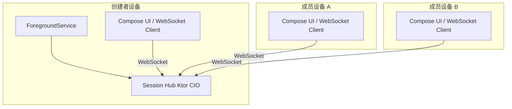

# 局域网临时共享相册 — Android 首期技术设计文档

> **文档版本**：1.0  
> **关联文档**：《详细需求文档.md》  
> **范围**：Android 原生首期实现；协议作为后续 iOS 的跨端契约基准

---

## 1. 文档说明

### 1.1 目的

本文档在需求规格基础上，给出**可落地的架构、模块边界、协议细节、并发模型、关键流程与工程约束**，供开发与测试直接对照实现与验收。

### 1.2 设计原则

- **Hub 权威**：房间状态以 Session Hub 内存态为准，`v` 单调递增，客户端乐观 UI 可被覆盖（LWW）。  
- **预览优先、原图按需**：控制面与预览走 WebSocket；原图大数据走**分块 + 背压**，避免拖垮创建者设备。  
- **单写者状态**：`RoomState` 仅在 Hub 内单协程/单 Actor 修改，杜绝并发写。  
- **可演进协议**：所有消息带 `pv`；新增字段尽量**向后兼容**（忽略未知字段）。

### 1.3 术语

与《详细需求文档》一致：创建者/Host、成员/Member、Session Hub、房间、joinToken、房间版本 `v`、预览图、原图。

---

## 2. 系统架构

### 2.1 拓扑

采用**星型拓扑**：

- **Session Hub** 仅运行在**创建者**设备（嵌入 App 进程，由前台服务驱动生命周期）。  
- **所有客户端**（含创建者本机 UI 层）以 **WebSocket 客户端**连接 `ws://{host}:{port}{path}`。  
- **禁止**要求普通成员设备监听入站端口（降低防火墙/NAT/厂商限制问题）。



### 2.2 逻辑分层

| 层级 | 职责 |
|------|------|
| **表现层** | Compose 页面、导航、扫码、通知跳转 |
| **会话域** | 角色（Host/Member）、房间生命周期、与 Hub 或远程 Hub 的连接状态 |
| **传输层** | WebSocket 连接管理、心跳、重连、消息编解码 |
| **Hub 域**（仅 Host） | 鉴权、会话列表、广播、`RoomState` 单写者、原图转发调度 |
| **媒体域** | 相册读取、预览生成、原图分块读/写、MediaStore 写入 |
| **协议层** | `pv` / `type` / 载荷 DTO、二维码 JSON 契约 |

### 2.3 技术栈（落实）

| 类别 | 选型 | 说明 |
|------|------|------|
| 语言/UI | Kotlin、Jetpack Compose、Navigation | 单 Activity 或多 Activity 均可，建议单 Activity + Navigation |
| 异步 | Coroutines、Flow | Hub 内 IO 使用 `Dispatchers.IO` 或 Ktor 上下文；状态流用 `StateFlow`/`SharedFlow` |
| DI | Hilt（可选） | 便于替换 Fake Hub 做仪器测试 |
| Hub | Ktor Server **CIO**、`webSocket` 路由 | 监听 `0.0.0.0:port` 以便热点网段访问 |
| 序列化 | kotlinx.serialization | JSON 文本帧；二进制大块见 §7 |
| 图片 | Coil（展示）、Android `BitmapFactory` + `inSampleSize` + `compress`（预览生成） | 预览参数可配置，默认长边 720～1080 |

---

## 3. Android 组件与生命周期

### 3.1 创建者（Host）

| 组件 | 职责 |
|------|------|
| **ForegroundService** | 持有 Ktor `ApplicationEngine` 生命周期；展示持久通知（返回 App、结束共享） |
| **Activity / Compose** | 选图、开房、展示二维码、刷新码、结束共享；本机仍以 WS 客户端连 Hub（简化架构，避免双通道） |

**启动顺序建议**：

1. 用户确认开房 → 申请通知权限（Android 13+）→ 启动前台服务 → 启动 Ktor → 绑定成功后再展示二维码（避免码上端口错误）。  
2. 服务 `onDestroy`：**优雅关闭** WebSocket 连接与 Engine，释放端口。

### 3.2 成员（Member）

- 仅 **Activity + Compose**，无前台服务要求（除非产品后续增加后台传图）。  
- 扫码解析 JSON → 建立 WebSocket → `hello`/`join` 鉴权 → 同步状态。

### 3.3 明确禁止

- **不得**使用 `BOOT_COMPLETED` 自动启动 Hub。  
- **不得**在成员侧长期后台无限制保活传原图（首期以用户主动操作为触发）。

### 3.4 端口与监听

- **绑定地址**：`0.0.0.0`，确保来自热点客户端的入站连接可达。  
- **端口策略**：固定默认端口 + 占用时递增重试（如 `18080`～`18100`），将**实际端口**写入二维码；或用户可配置（P1）。  
- **路径**：`path` 建议固定如 `/session`，与二维码一致，避免与潜在 HTTP 路由冲突。

### 3.5 网络地址变化

- 监听 `ConnectivityManager` / `NetworkCallback`，当 **本机 IP 变更** 时：  
  - 更新二维码中的 `host`（及必要时 `port`）；  
  - **joinToken 不变**；  
  - 可选向已连接客户端广播 `host.changed`（见 §6.2），减少用户无感断连。

---

## 4. 权限与 Manifest 要点

### 4.1 权限列表

| 权限 | 用途 |
|------|------|
| `INTERNET` | 本地 socket（系统仍常要求声明） |
| `ACCESS_NETWORK_STATE` | 判断网络可用、注册 NetworkCallback |
| `ACCESS_WIFI_STATE`（可选） | 辅助展示 IP / 诊断 |
| `READ_MEDIA_IMAGES` / 旧版存储读权限 | 读取相册 |
| `WRITE_EXTERNAL_STORAGE` | 仅低版本或兼容路径按需 |
| `POST_NOTIFICATIONS` | Android 13+ 前台通知 |
| `FOREGROUND_SERVICE` + **具体类型** | 按 targetSdk 选用 `connectedDevice` 或 `dataSync` 等合规类型（以法务/上架审核为准最终定案） |

### 4.2 前台服务类型

- 需在清单中声明 `foregroundServiceType`，并与实际行为一致（局域网数据同步 + 本地服务器）。  
- 通知渠道：高优先级、持久、不可滑动清除（按系统规范）。

---

## 5. 核心数据模型（Hub 权威）

### 5.1 标识

- `roomId`：`String`，UUID 或高熵随机，会话内唯一。  
- `joinToken`：`String`，**高熵**（建议 ≥ 128 bit 随机，URL-safe 编码）；**开房至结束不变**。  
- `clientId`：每个 WebSocket 连接分配 `String`（UUID），用于定向消息（如原图块转发）。  
- `memberId` / `displayName`（可选）：业务展示用，可与 `clientId` 映射。

### 5.2 媒体条目 `MediaItem`（建议字段）

| 字段 | 类型 | 说明 |
|------|------|------|
| `id` | String | 全局唯一（建议 UUID），会话内稳定 |
| `ownerClientId` | String | **持有原图**的设备对应连接 id（创建者或某成员） |
| `localUri` | 不在 Hub 存储 | 仅各端本地：Hub 只存 `ownerClientId` + `id` |
| `previewHash` | String? | 可选，用于缓存去重 |
| `width` / `height` | Int? | 元数据，便于 UI |
| `takenAt` | Long? | 可选排序用 |
| `star` | Int / Boolean | 打星 |
| `note` | String | 备注 |
| `inSelection` | Boolean | 入选集 |
| `order` | Double 或 Long | 排序键（浮点便于中间插入） |

**删除语义（实现约束）**：`removed` 标记或自 `orderedIds` 移除；**不删除**任何设备上的 MediaStore 源文件。

### 5.3 房间状态 `RoomState`

Hub 内存中维护：

- `v`：`Long`，从 0 或 1 起步，**每次状态变更 +1**。  
- `items`：`Map<String, MediaItem>` 或列表 + 索引。  
- `order`：有序 id 列表，表达当前展示顺序。  
- `createdAt` / `title`（可选）。

**单写者**：所有修改走 `RoomActor`（单协程 channel 或 Mutex 包裹的 suspend 函数），读快照可通过 `StateFlow` 暴露给 Hub 内部广播逻辑。

### 5.4 客户端本地缓存

- **预览图**：可按 `mediaId` 落盘或内存 LRU；会话结束策略与产品一致（建议 **结束即清** 或进程内缓存）。  
- **原图**：仅保存到用户相册目录时在成员侧产生；Hub **不落盘**原图（仅内存流转发，见 §7）。

---

## 6. WebSocket 消息协议（JSON 文本帧）

### 6.1 信封（Envelope）

每条 JSON 消息必须包含：

```json
{
  "pv": 1,
  "type": "string",
  "v": 0,
  "cid": "client-generated-uuid",
  "payload": { }
}
```

| 字段 | 说明 |
|------|------|
| `pv` | 协议版本；Hub 与客户端不一致时返回 `error.protocol` |
| `type` | 消息类型，见下表 |
| `v` | **Hub 发出的状态版本**；客户端上行部分消息可带 `baseV` 于 payload 用于乐观锁（可选 P1） |
| `cid` | 客户端生成，用于日志与 ACK 关联 |
| `payload` | 任意对象；无则 `{}` |

### 6.2 消息类型（首期最小集）

**连接与房间**

| type | 方向 | 说明 |
|------|------|------|
| `join` | C→H | `token`、`clientRole`、`appVersion`；成功则回 `joined` |
| `joined` | H→C | 当前快照 + `v` |
| `error` | H→C | `code`、`message`、`fatal` |
| `ping` / `pong` | 双向 | 心跳；间隔 15～30s 可配 |
| `host.changed` | H→C | 新 `host`/`port`/`path`（可选） |

**状态协作**

| type | 方向 | 说明 |
|------|------|------|
| `state.patch` | C→H | 协作操作：删、排序、改星、备注、入选等 |
| `state.broadcast` | H→ALL | 新 `v` + 完整快照或增量 patch（建议首期**全量快照**降低复杂度，照片上千时再上增量） |
| `media.add` | C→H | 成员或创建者向房间添加条目（含 `ownerClientId`、元数据） |
| `media.remove` | C→H | 会话内移除 id |

**说明**：若首期采用「每次变更广播**全量 `RoomState`**」，实现简单；需控制 payload 大小（条目数千时改增量 + 分页，P1）。

### 6.3 `join` / `joined` 载荷示例

**join payload**

```json
{
  "token": "joinToken-from-qr",
  "role": "host | member",
  "deviceName": "Pixel 8"
}
```

**joined payload（示例）**

```json
{
  "roomId": "...",
  "yourClientId": "...",
  "v": 42,
  "state": { "items": [], "order": [] }
}
```

### 6.4 错误码（建议）

| code | 含义 |
|------|------|
| `error.auth` | token 无效 |
| `error.protocol` | pv 不支持 |
| `error.room_closed` | 房间已结束 |
| `error.rate_limited` | 发送过快 |
| `error.internal` | Hub 内部错误 |

---

## 7. 预览图与原图传输

### 7.1 预览图（首期推荐）

**方案 A（推荐）**：预览作为 **Base64 内嵌于 JSON** 仅适用于极小批量；**不建议**作为主力。

**方案 B（推荐）**：单独定义二进制帧协议复杂度高，首期可采用：

- **HTTP 同端口**：Ktor 同时挂 `get("/preview/{mediaId}")`，携带短期 query `sig` 或 header `X-Client-Id` + Hub 校验；或  
- **WebSocket 分片 JSON**：`preview.chunk` + index/total + base64（实现简单但 CPU/体积差），**仅小图可接受**。

**方案 C（平衡）**：Hub 转发：持有方发 `preview.upload` 多帧（见 §7.3 帧头），Hub 合并后缓存于**内存 LRU**（设上限如 128MB），其他端 `preview.get` 从 Hub 拉取。避免重复从持有方拉同一预览。

**工程建议**：团队**二选一**——「HTTP 同端口 GET 预览」或「WS 二进制分块」；在 `pv` 中标注能力协商字段 `capabilities`。

### 7.2 原图：分块转发（首期必选路径）

目标：持有方 → Hub → 请求方；**Hub 不整文件落盘**，使用**流式 + 固定缓冲**。

**控制消息（JSON）**

| type | 说明 |
|------|------|
| `file.request` | 请求方：`mediaId`、`requestId` |
| `file.accept` | Hub：同意转发，分配 `transferId`，可带 `chunkSize` |
| `file.reject` | Hub：队列满、无权限、持有者离线等 |
| `file.done` / `file.abort` | 结束或取消 |

**数据面（建议二进制 WebSocket 帧）**

在**同一 WebSocket** 上复用：定义二进制帧首字节 `0x01` 为原图块，后跟：

```
transferId (16 bytes UUID)
sequence (4 bytes big-endian uint)
flags (1 byte: last=0x1)
payload (length = frame - header)
```

持有方与请求方各自与 Hub 建立**逻辑管道**；Hub 使用 `ByteArray` 环形缓冲或直接 `ByteReadChannel` 透传，**限制**：

- 全局最多 **N** 个并发 `transferId`（如 2～3）。  
- 每连接待发队列上限（如 64 块）。  
- 单块默认 **256KB～1MB** 可配置。  
- 超时无数据则 `file.abort`。

若首期坚持**纯 JSON**，可用 `file.chunk` + base64，仅限小文件或原型阶段；**大原图必须二进制**。

### 7.3 背压与资源上限

| 参数 | 建议初值 | 说明 |
|------|----------|------|
| 最大并发原图传输 | 2 | 可配置 |
| Hub 预览内存 LRU | 64～128 MB | 按设备调整 |
| 单消息 JSON 上限 | 如 4 MB | 超过则拒绝或改 HTTP |
| WebSocket 空闲超时 | 60～120 s | 配合 ping |

---

## 8. 二维码载荷

JSON 字符串 UTF-8，扫码后解析（注意换行与转义）：

```json
{
  "pv": 1,
  "roomId": "uuid",
  "token": "high-entropy-token",
  "host": "192.168.43.1",
  "port": 18080,
  "path": "/session"
}
```

- **生成**：每次展示前用当前 `host/port` 序列化生成 Bitmap 二维码。  
- **刷新**：仅更新网络字段；`token` 不变。

---

## 9. 并发与线程模型

| 区域 | 模型 |
|------|------|
| `RoomState` | **单协程 Actor**（`Channel` 队列）或 `Mutex` + `suspend` 修改 |
| Ktor 连接处理 | 每连接 `launch`，内部禁止直接改状态，应 `send` 到 Actor |
| 预览/原图 IO | `Dispatchers.IO`；与状态 Actor 交互通过消息 |
| UI | `Main`；收集 `StateFlow` 更新界面 |

---

## 10. 客户端状态机（简述）

### 10.1 Host

`Idle` → `StartingService` → `HubRunning` → `Sharing` → `Stopping` → `Idle`  
错误：`HubStartFailed`（端口占用、无网络）

### 10.2 Member

`Disconnected` → `Connecting` → `Joined` → `Syncing` → `Ready`  
断线：`Reconnecting`（指数退避，最大间隔；token 仍有效）  
 join 失败：`AuthFailed` / `RoomClosed`

---

## 11. 安全（首期与演进）

- 传输：**明文 WS**；隐私政策写明同网段 token 风险。  
- **joinToken**：密码学安全随机数生成器（`SecureRandom`）。  
- **可选 P1**：TLS（自签名证书 + 指纹展示扫码）；或应用层 AES 密钥通过二维码旁路传输（复杂度高，谨慎）。  
- **输入校验**：所有 JSON 字段长度上限（备注、设备名等）防 DoS。

---

## 12. 日志、观测与调试

- 统一 `cid` / `roomId` / `clientId` 打日志；生产包可关闭详细 payload。  
- 提供 **开发者选项**：Hub 流量统计、连接列表、`v` 曲线（仅 debug）。  
- 崩溃上报：Firebase/Crashlytics（若项目已有）；注意**不上传**用户照片二进制。

---

## 13. 测试策略

| 类型 | 要点 |
|------|------|
| 单元测试 | `RoomState` 转换、`order` 计算、token 校验 |
| 仪器测试 | Fake Hub 或 Test Ktor；WebSocket 集成 |
| 多机实测 | 热点、双 Wi‑Fi、大文件、弱网、杀进程重进 |
| 验收 | 对照《详细需求文档》AC-1～AC-8 |

---

## 14. 模块与包结构建议（可选）

```
app/
  hub/           # Ktor 启动、路由、RoomActor
  protocol/      # Envelope、type、序列化
  session/       # Host/Member 会话控制器
  media/         # 相册、预览、原图 IO
  ui/            # Compose
```

---

## 15. Gradle 依赖参考（版本号随项目统一）

```kotlin
// 示例，以项目 BOM 为准
implementation("io.ktor:ktor-server-cio:2.x")
implementation("io.ktor:ktor-server-websockets:2.x")
implementation("org.jetbrains.kotlinx:kotlinx-serialization-json:1.x")
implementation("io.coil-kt:coil-compose:2.x")
```

---

## 16. 风险与对策（技术侧）

| 风险 | 对策 |
|------|------|
| OEM 杀后台 | 前台服务 + 用户提示；接受「杀进程即停」 |
| 大屏内存预览 | LRU + 磁盘缓存可选；降采样 |
| JSON 过大 | 状态广播改增量/分页；预览走 HTTP |
| 端口不可达 | 防火墙提示；绑定 0.0.0.0；端口重试 |

---

## 17. 修订记录

| 版本 | 日期 | 说明 |
|------|------|------|
| 1.0 | 2026-04-08 | 首版：架构、协议、原图分块、并发、组件与测试 |

---

## 18. 与需求文档的追溯

| 需求要点 | 本文档章节 |
|----------|------------|
| 星型 Hub + 全员 WS | §2、§3 |
| 前台服务、禁止 Boot | §3、§4 |
| 二维码 token 不变 | §5、§8 |
| 预览为主、原图按需分块 | §7 |
| `v` + LWW、单写者 | §5、§9 |
| 明文 WS + 风险说明 | §11 |
| iOS 预留同协议 | §6、§8（字段稳定） |
